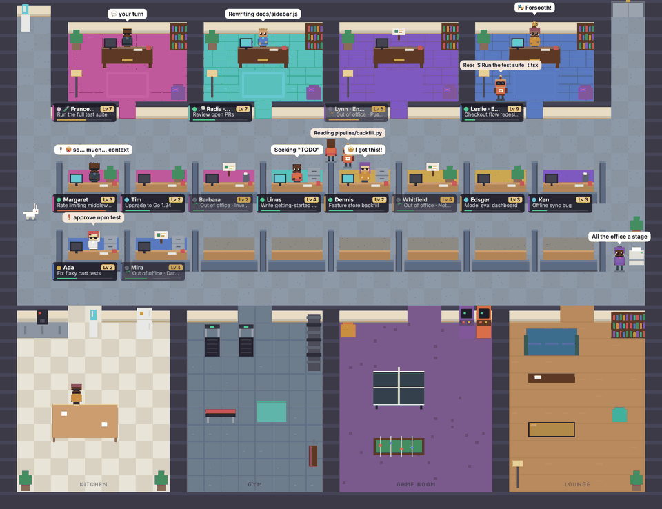
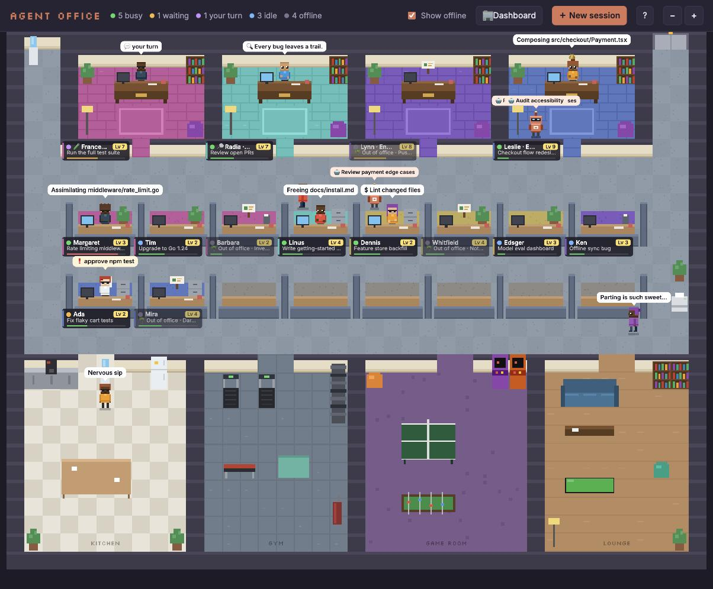
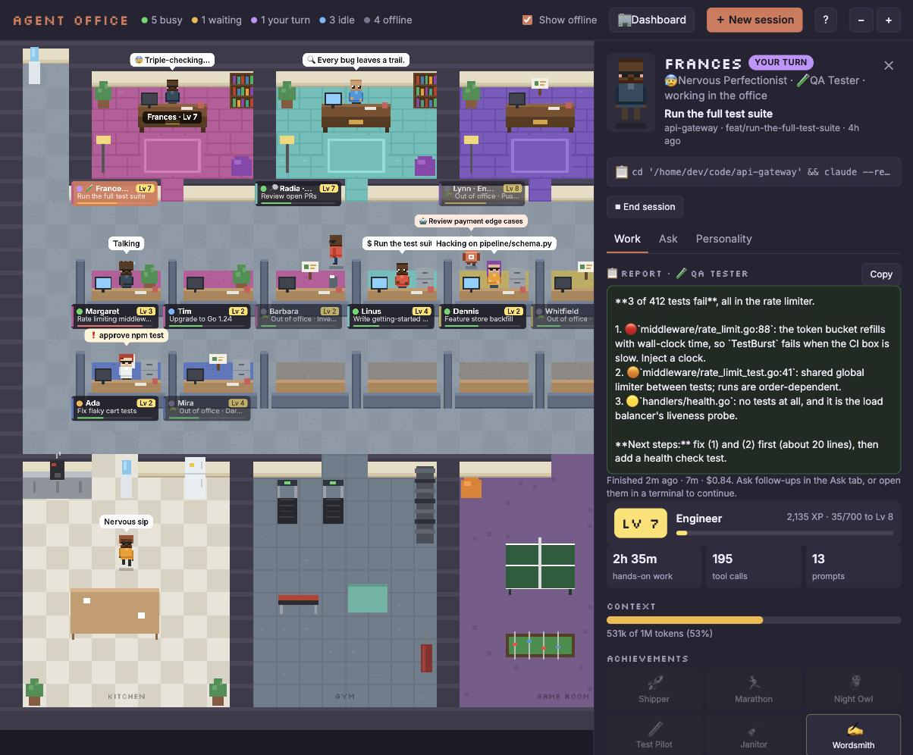
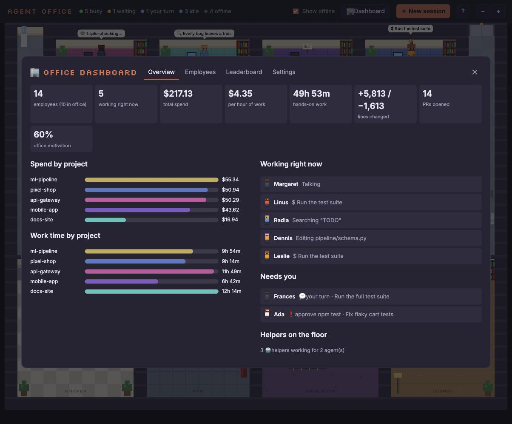
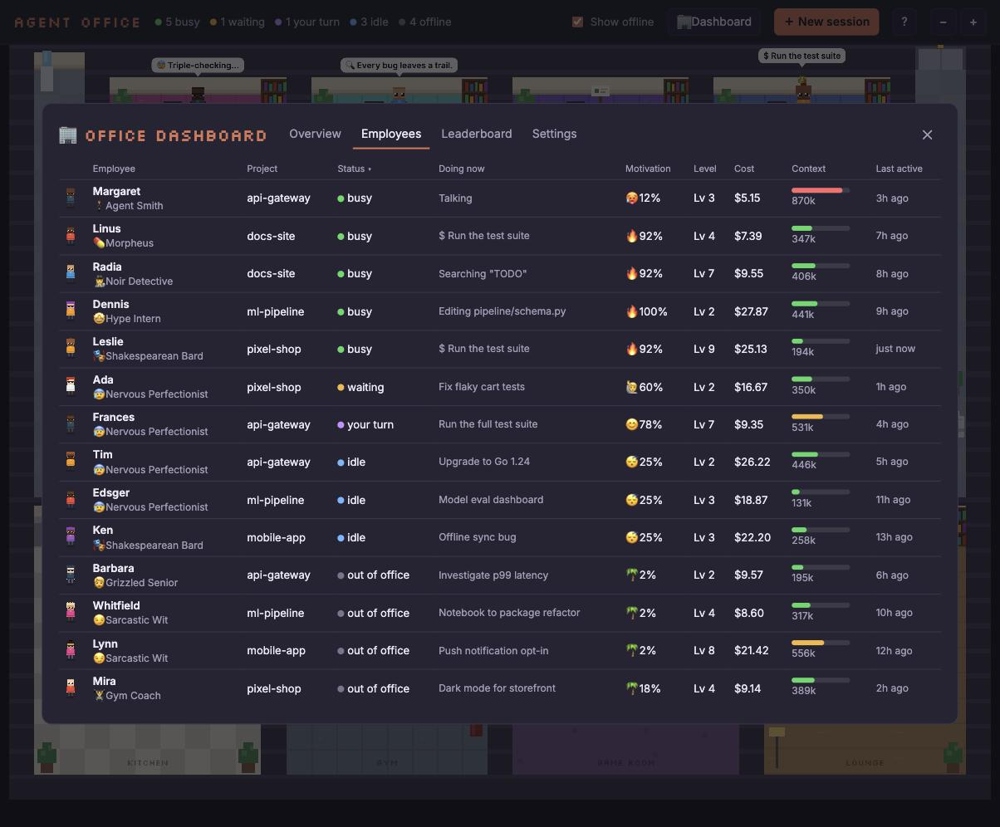
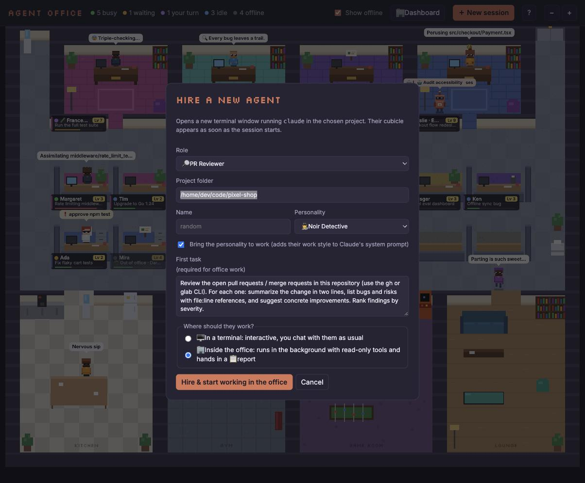
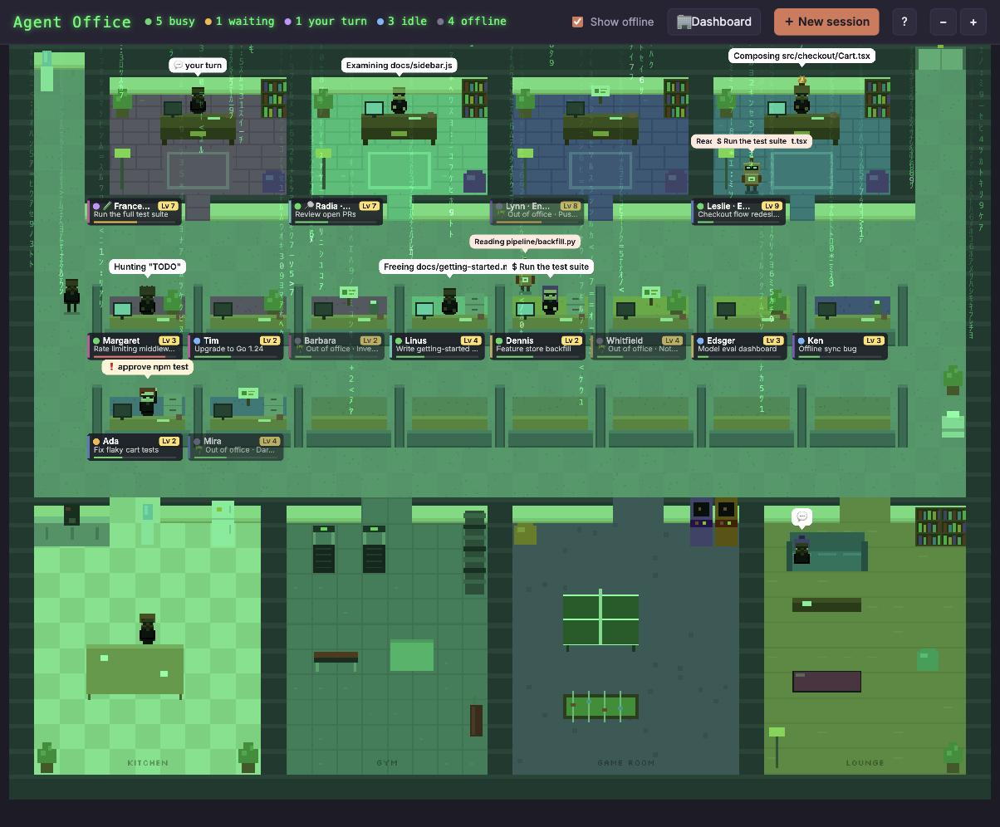
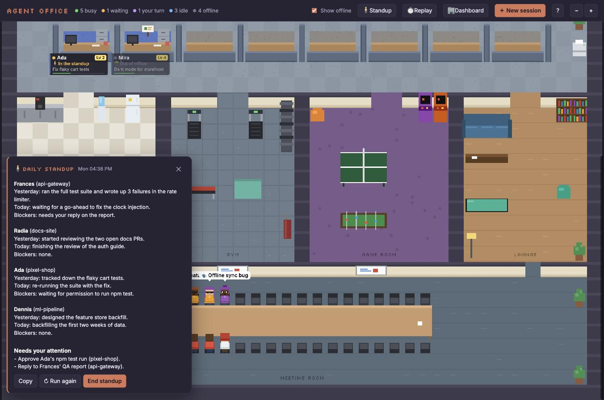
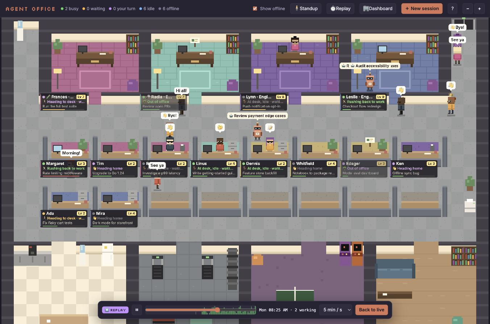
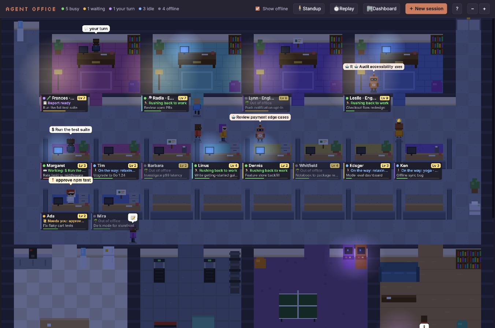

# Agent Office

**A pixel-art office where your Claude Code sessions come to life as coworkers.**



When you run several Claude Code sessions at once, it gets hard to keep track of them: which one is busy, which one is waiting for your permission, which one finished ten minutes ago and is waiting on you. Agent Office reads the session data Claude Code already keeps on your machine and turns every session into a little pixel-art employee with a desk, a status, a personality and a career. You can see at a glance who needs you, jump back into any session with one click, and have some fun along the way.

It is a single zero-dependency Node server plus a canvas front end. Every sprite is drawn procedurally in code; there are no image assets.

## Features

### Office
- Every recent Claude Code session gets its own cubicle, grouped by project (the coloured stripe on a nameplate marks the project).
- Every nameplate shows a live **status line** saying what the agent is doing right now: "⌨️ Working: Editing Cart.tsx", "🙋 Needs you: approve npm test", "☕ Coffee break", "🏓 Playing ping pong", "👀 Checking on Pam", "🌴 Out of office" and so on.
- A kitchen, gym, game room and lounge where agents spend their breaks, and a meeting room for standups.
- Agents arrive and leave through the elevator.
- **Themes**: Classic, Startup loft, Dunder Mifflin beige and Space station (Dashboard → Settings).
- **Day and night**: lighting follows your clock. At night the office dims, lamps and busy monitors glow, and night-owl agents 🦉 take the night shift. You can also force day or night.
- Zoom in and out, or fit the whole office to the window.

### Agents & status
Live status comes from `~/.claude/sessions`:
- **Busy**: typing at their desk; the speech bubble shows the current tool ("Editing Cart.tsx", "$ Run the test suite").
- **Waiting**: hand raised, needs your permission or input.
- **Your turn**: just replied and sitting at their desk waiting for you. If you don't answer within 5 minutes (configurable), they go on a break, and their status line says "… · waiting for you".
- **Idle**: on a break: coffee in the kitchen, the gym, ping pong or the arcade, the sofa, chatting with each other, or peeking into a busy colleague's cubicle.
- **Offline**: out of office with an empty chair. Hide them with the *Show offline* toggle.
- Subagents show up as little helper robots that ride the elevator and stand at the parent's desk until their job is done.

### Progress & gamification
- XP from hands-on work time, tool calls, lines changed, prompts, helpers spawned and pull requests.
- Levels with ranks from Intern to Legend, 12 achievements, and a 👑 for the top agent.
- At level 5 an agent is promoted out of their cubicle into a private office in the executive wing.
- A context bar under every nameplate shows context window usage. Above 80% the agent starts sweating and mutters "maybe /compact?".

### Personalities
- Presets such as Grizzled Senior, Hype Intern, Zen Monk, Sarcastic Wit, Pirate Captain, Nervous Perfectionist, Noir Detective, Shakespearean Bard, Gym Coach, Neo, Morpheus and Agent Smith, plus the Dunder Mifflin crew: Michael Scott, Dwight Schrute, Jim Halpert, Pam Beesly, Stanley Hudson, Creed Bratton, Angela Martin, Kevin Malone, Oscar Martinez and Andy Bernard.
- **Personality packs** (Dashboard → Settings): *Staff the office with Dunder Mifflin* casts everyone at once with names, personalities and matching looks. Casting goes by XP, so your top agent becomes Michael, with the corner office. It leaves personalities you customised alone unless you ask it to replace them, and *Back to default personalities* undoes it.
- A personality changes how an agent types, fidgets, walks, talks and where they hang out.
- Customise name, traits, favourite hangout and look (skin, hair, clothes, hair style, glasses), or let Claude generate quirks for them.
- **Bring this personality to work**: when you start or resume a session from the office, the personality's work style is passed to Claude via `--append-system-prompt` (a Perfectionist tests everything, a Detective finds the root cause first, a Senior keeps diffs minimal).

### Roles & background agents
- Hire a **🔧 Fixer**, **PR Reviewer**, **QA Tester**, **Bug Hunter**, **Security Auditor** or **Docs Reviewer** from *New session*.
- Run them interactively in a terminal, or **inside the office**: a background `claude -p` run that hands in a 📋 report, shown in the agent's panel. Reviewers and auditors are read-only. A Fixer edits and commits on its own branch in a separate git worktree, and never pushes.
- Background agents can read the office TODO board, add follow-ups, and mark their own card done.

### The Product Manager and the TODO board
- **You're the boss, and 👔 Morgan the Product Manager works for you.** Morgan is a permanent resident with a desk in the meeting room, and hosts the standups. Each time you ask something, the office sends a fresh briefing of every agent (status, what they're doing, recent messages, reports) and the board, so the PM always knows what everyone is working on.
  - **Ask the PM** anything: "What's blocked?", "What should I focus on today?", "Is anyone duplicating work?".
  - **🗓️ Plan my day** suggests today's priorities as board cards you can add with one click.
  - **🖥️ Start a PM session** opens a real Claude session as the PM, which can manage the office through the agent-office tools (read the office, update the board, hire agents).
- **📋 Office board** (<kbd>B</kbd>, or click the sticky-note board on the meeting-room wall): To do / In progress / Done. Add cards, drag them between columns, and **🤝 Give** a card to an agent or **🏢 Hire** someone for it. Cards move to *In progress* on their own, and background agents move them to *Done* when they finish. Agents can read the board, add cards and tick them off themselves (with the office tools connected, see below): background agents always can, and sessions started from the office are told to use it. The standup reports board progress.

### Standups, handoffs and replay
- **Daily standup** (<kbd>M</kbd>): everyone in the office walks to the meeting room, and a summary streams in (in about 15 seconds). It opens with the day's exact totals and a short **summary of the day**, then what **needs your attention**, then *Yesterday / Today / Blockers* for each agent who actually worked that day (or in the last 24 hours before anyone has started).
- **Handoffs**: drag a report (or a latest reply) from the panel onto another agent, or use 🤝 *Hand off*. You get an editable first task ("Bug Hunter found this, Dwight fix it"), and it opens in a terminal, either continuing the target's session (they keep their memory) or as a new session in their project with their personality.
- **Timeline & replay** (<kbd>T</kbd>): replay the last 24 hours at 1 minute to 1 hour per second. Scrub along an activity graph and watch agents arrive, work, take breaks and leave, just as they did.

### Agents hiring agents
Senior agents (level 5+ by default) can hire coworkers themselves, mid-task, to work in parallel:
- Click **🔌 Connect to Claude Code** in Dashboard → Settings (or run the command shown there). It registers the bundled `agent-office` MCP server in your Claude Code user settings, and every session started afterwards gets the office tools: `hire_agent`, `list_my_hires`, `get_report`, `office_overview`, `todo_list`, `todo_add` and `todo_update`. Hiring needs the minimum level (a PM session may always hire); the board and overview tools are open to every connected agent.
- A **🔧 Fixer** gets its own git branch (`office/<name>-<id>`) in a separate worktree under `~/.agent-office/worktrees`. It may edit, run tests and checks, and commit there, but never push. Your working copy and the senior agent's are never touched. Its report names the branch to review (`git diff HEAD...office/…`).
- **PR Reviewer, QA Tester, Bug Hunter, Security Auditor** and **Docs Reviewer** hires are read-only, as in the office roles.
- The office decides who may hire: it identifies the calling session from the MCP server's parent process, checks its level, and enforces a limit of active hires per agent (3 by default). You can change all of this, or switch hiring off, in Settings.
- Hires walk into the office with a **👥 hired by …** badge, and you get a toast. Hires can't hire others: background agents only get the board and overview tools, not the hiring ones, and none of your other MCP servers.

### Dashboard
Press <kbd>D</kbd> for the office dashboard. Every card and section explains what it measures, and everything has a hover tooltip:
- **Overview**: total spend, spend per hour of work, hands-on work time, lines changed, PRs, office motivation, spend and work time by project, who's working right now and who needs you.
- **Employees**: a sortable table with status, what they're doing now, motivation, level, cost, context usage and last activity.
- **Leaderboard** and **Settings**.

### Session control
- **Click an agent** to copy `cd <project> && claude --resume <id>` and open their panel:
  - **Work**: latest report, level, XP, context gauge, achievements, stats, latest replies, prompts and files touched.
  - **Ask**: ask the agent a question. ⚡ *Quick* answers in seconds from a briefing of the session; 🧠 *Deep memory* asks a forked copy of the full conversation. The real session is never touched.
  - **Personality**: name, preset, traits, hangout and look.
- **New session**: opens a terminal (iTerm or Terminal on macOS; gnome-terminal, kitty, konsole, alacritty, wezterm, xfce4-terminal or xterm on Linux) running `claude --session-id <new id>` in the chosen folder, with the personality and role pre-assigned.
- **Open in terminal**: resume a session in a new terminal window.
- **End session**: stops a running `claude` process with SIGTERM (two-step confirm; the transcript is kept).
- **Hide**: remove a cubicle from the office (bring it back later from Settings).

### Easter eggs
- Type `matrix` (or click the white rabbit that sometimes hops by) for digital rain and trench coats; type `bluepill` to leave. The Konami code works too.
- Type `dundermifflin` and the office becomes the Scranton branch for a minute.
- A black cat walks by twice. Déjà vu.
- Agent Smith occasionally copies himself onto a coworker.

## Screenshots

<table>
  <tr>
    <td width="50%"><br><sub><b>The office.</b> Cubicles grouped by project, private offices up top, break rooms below.</sub></td>
    <td width="50%"><br><sub><b>Agent panel.</b> A QA Tester that ran in the background and handed in a report.</sub></td>
  </tr>
  <tr>
    <td><br><sub><b>Dashboard.</b> Spend, work time and who needs you.</sub></td>
    <td><br><sub><b>Employees.</b> Status, motivation, level, cost and context for everyone.</sub></td>
  </tr>
  <tr>
    <td><br><sub><b>Hire a new agent.</b> Pick a role, a personality and where they should work.</sub></td>
    <td><br><sub><b>Matrix mode.</b> Follow the white rabbit.</sub></td>
  </tr>
  <tr>
    <td><br><sub><b>Daily standup.</b> Everyone in the meeting room, with yesterday, today and blockers.</sub></td>
    <td><br><sub><b>Replay.</b> Scrub through the day and watch who worked when.</sub></td>
  </tr>
  <tr>
    <td><br><sub><b>Night shift.</b> Lighting follows your clock.</sub></td>
    <td></td>
  </tr>
</table>

All screenshots use demo mode: the agents, projects and numbers are made up.

## Quick start

```sh
git clone https://github.com/alminisl/agent-office && cd agent-office && npm start
```

Then open <http://localhost:4747>. Press <kbd>?</kbd> in the app for the legend and shortcuts.

Want to try it without touching your own sessions, or show it in a talk?

```sh
npm run demo
```

Demo mode serves a completely made-up office. Nothing is read from `~/.claude`.

There is nothing to install: no dependencies, no build step.

**Optional:** to let your Claude sessions use the office themselves (read and add to the TODO board, see what everyone is doing, and hire coworkers at level 5+), open **Dashboard → Settings** and click **🔌 Connect to Claude Code**. It runs `claude mcp add --scope user agent-office …` for you; *Disconnect* removes it again.

## How it works

- **Sessions** come from the transcripts in `~/.claude/projects/**.jsonl` (the last 14 days, up to 20 cubicles; running sessions are always shown). Transcripts are parsed for titles, prompts, replies, tool calls, files, lines changed, PRs, cost and context usage, and cached by modification time.
- **Live status** comes from `~/.claude/sessions`, which tells the office which sessions are running, busy or waiting.
- **Helpers** are the subagent transcripts of a running session that were touched in the last 45 seconds.
- **Ask** has two modes, and both stream the answer word by word:
  - ⚡ **Quick** (default): the server builds a short briefing from the transcript (task, recent prompts and replies, files touched, current activity) and asks a fast model (`ASK_MODEL`, default `haiku`) in character. It takes a few seconds whatever the session size.
  - 🧠 **Deep memory**: `claude -p --resume <id> --fork-session --no-session-persistence --tools ""`, a throwaway fork of the full conversation with no tools. It has complete memory, but it re-reads the whole context, so it is slow and costs more on big sessions (the Ask tab shows how many tokens).
- **Quirks** are generated with a small `claude -p --model haiku --tools ""` call.
- **Background roles** run `claude -p` with `--allowedTools` decided on the server per role, never taken from the browser. Anything not on the list is denied automatically in print mode, so these agents can read and inspect, but not edit, push or merge:
  - All roles: `Read`, `Grep`, `Glob`, and `git log / diff / show / status / branch / fetch / blame`, `ls`.
  - PR Reviewer: also `gh pr list / view / diff / checks` and `glab mr list / view / diff`.
  - QA Tester and Bug Hunter: also common test runners (`npm test`, `vitest`, `jest`, `pytest`, `go test`, `cargo test`, `make test`, `rspec`, Django tests, ...).

  - Fixer: `Read`, `Grep`, `Glob`, `Edit`, `Write`, `git status / diff / log / show / add / commit`, test runners and checks (`node --check`, lint, typecheck), in its own worktree under `~/.agent-office/worktrees`. It has no push.
  - Every background agent also gets the office board and overview tools (`todo_list`, `todo_add`, `todo_update`, `office_overview`) through `--strict-mcp-config`, so none of your other MCP servers are loaded.

  The final report is saved to `data/reports/` and shown in the agent's panel.
- **The Product Manager, the standup and Plan my day** build a fresh briefing of every agent (status, recent prompts and replies, reports) and the board, and ask a model (`PM_MODEL` / `STANDUP_MODEL`) with extended thinking off so answers start within a second or two. The standup's date and totals are computed by the server, not the model.
- **Replay** rebuilds the day from the turn and tool-call timestamps in the transcripts.
- **The office tools** (`mcp.mjs`) are a dependency-free MCP server. It identifies the calling session from its parent processes, and the office checks levels and limits before hiring.
- **Personalities, hidden cubicles, the TODO board, settings and reports** are stored locally in `data/` (ignored by git). Writes are queued per file and atomic, with a `.bak` of the last good version.

## Configuration

All settings are optional environment variables:

| Variable | Default | Description |
| --- | --- | --- |
| `PORT` | `4747` | Port to serve the office on |
| `MAX_DAYS` | `14` | How many days back to look for sessions |
| `MAX_ROOMS` | `20` | Maximum number of cubicles |
| `CLAUDE_DIR` | `~/.claude` | Where Claude Code keeps its data |
| `CLAUDE_BIN` | `claude` | The Claude Code executable |
| `OFFICE_TERMINAL` | macOS: `iTerm` if you run inside iTerm, else `Terminal`. Linux: the first of gnome-terminal, kitty, konsole, alacritty, wezterm, xfce4-terminal, xterm found on your PATH | Terminal used by New session, Open in terminal and handoffs |
| `ASK_MODEL` | `haiku` | Model used by Quick mode in the Ask tab |
| `STANDUP_MODEL` | `ASK_MODEL` | Model that writes the standup summary |
| `PM_MODEL` | `sonnet` | Model the Product Manager answers with |
| `CONTEXT_WINDOW` | `200000` (or 1M for `[1m]` models) | Context window size used for the context bar |
| `DEMO` | unset | Set to `1` for demo mode (same as `--demo`) |

Example: `PORT=8080 MAX_DAYS=7 npm start`

## Keyboard shortcuts

| Key | Action |
| --- | --- |
| <kbd>?</kbd> | Help |
| <kbd>N</kbd> | New session (hire an agent) |
| <kbd>D</kbd> | Office dashboard |
| <kbd>B</kbd> | Office TODO board |
| <kbd>M</kbd> | Daily standup |
| <kbd>T</kbd> | Replay the last 24 hours (<kbd>Space</kbd> to play / pause) |
| <kbd>S</kbd> | Show / hide offline agents |
| <kbd>Tab</kbd> / <kbd>Shift</kbd>+<kbd>Tab</kbd> | Cycle through agents |
| <kbd>O</kbd> | Open the selected agent in a terminal |
| <kbd>C</kbd> | Copy the resume command |
| <kbd>A</kbd> | Ask the selected agent a question |
| <kbd>H</kbd> | Hide the selected cubicle |
| <kbd>+</kbd> / <kbd>-</kbd> | Zoom in / out |
| <kbd>0</kbd> | Fit to window |
| <kbd>Esc</kbd> | Close panel / dialogs |

## Privacy & safety

- The server listens on `127.0.0.1` only and reads your Claude Code data locally. Your transcripts are never uploaded anywhere by Agent Office.
- The only things that leave your machine are what Claude Code itself sends when you use **Ask**, **the PM**, **the standup**, **Generate quirks** or a **background role**, all of which run the regular `claude` CLI with your account. The PM and the standup include a short briefing of your sessions in their prompt. The page also loads its fonts from Google Fonts.
- **Connect to Claude Code** adds one MCP server entry (`agent-office`) to your Claude Code user settings (`~/.claude.json`); *Disconnect* removes it.
- **Ask** never writes to your session: Quick mode uses a separate, non-persistent prompt, and Deep mode uses a forked, non-persistent copy. Both run with all tools disabled.
- **Background roles** get a fixed tool allowlist chosen on the server: read-only for reviewers and auditors, plus test runners for QA. **Fixers** can also edit and commit, but only inside their own git worktree and branch, and they can never push.
- **Hiring** only works for sessions on this machine at the required level, is rate-limited per agent, and can be switched off. The MCP server only talks to `127.0.0.1`.
- **End session** asks twice before sending SIGTERM, and only to a `claude` process.
- Personal settings live in `data/`, which is git-ignored.
- Use `npm run demo` for screenshots, recordings and talks so no real session data is shown.

## Requirements

- Node.js 18 or newer
- [Claude Code](https://docs.anthropic.com/en/docs/claude-code) installed and used at least once (so `~/.claude` exists)
- For the terminal features (New session, Open in terminal, handoffs): macOS (iTerm or Terminal via AppleScript) or Linux (gnome-terminal, kitty, konsole, alacritty, wezterm, xfce4-terminal or xterm). Everything else works wherever Node and Claude Code run.

## Project structure

```
server.mjs          Local HTTP server: parses ~/.claude, live status, XP, Ask, roles, hiring, terminal control
mcp.mjs             MCP server with the office tools (hiring, reports, office overview, TODO board)
demo.mjs            Made-up agents and projects for demo mode
public/
  index.html        UI shell: header, side panel, dialogs, dashboard, help
  app.js            Simulation, rendering, agents' behaviour, panel, dashboard, easter eggs
  world.js          Office layout: cubicles, private offices, break rooms, meeting room
  sprites.js        Procedurally drawn pixel-art characters and furniture
  personas.js       Personality presets, names, looks and quirks
  style.css         Styles
docs/               Screenshots and the GIF used in this README
data/               Your personalities, hidden cubicles and reports (git-ignored)
```

## Contributing

Issues and pull requests are welcome. The project deliberately has no dependencies and no build step, so please keep it that way. Some ideas:

- Windows terminal support for New session / Open in terminal
- More personalities, break-room activities and achievements
- More background roles
- Sound effects (optional, off by default)

## Disclaimer

Agent Office is an unofficial fan project. It is not affiliated with, endorsed by or supported by Anthropic. "Claude" and "Claude Code" are trademarks of Anthropic.

## License

TBD
